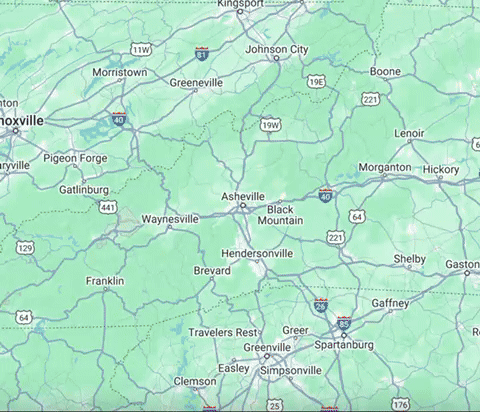

# Post-Hurricane Helene Pollutant Transport Risk Mapping

---

## Overview

This project uses **Google Earth Engine (GEE)** to map areas at high risk of pollutant transport in Western North Carolina as a result of Hurricane Helene, which impacted the region from September 24-27, 2024. By combining elevation, land cover, and precipitation parameters, a composite risk layer is generated to effectively identify hotspots where pollutants and debris are most likely to flow and end up as concentrated hotspots. The goal is to improve efficiency for environmental remediation efforts and resilience planning for Southern Appalachian communities.

---

## Data Sources

The analysis integrates several remote sensing and publicly available datasets:

| Dataset | Description | Provider |
|--------|-------------|----------|
| `USGS/WBD/2017/HUC10` | Watershed boundaries (HUC10 level) | USGS |
| `USGS/SRTMGL1_003` | Elevation data (30m SRTM DEM) | NASA / USGS |
| `USGS/NLCD_RELEASES/2019_REL/NLCD` | 2016 land cover classification | USGS |
| `UCSB-CHG/CHIRPS/DAILY` | Daily precipitation estimates | Climate Hazards Group |

---

## Methodology

The risk model evaluates potential pollutant transport flow based on three key parameters:

- Slope (30% weight)  
- Land Use (Urban, Agriculture, Forest) from land cover (40% weight)  
- Rainfall Intensity during Hurricane Helene (30% weight)

Each layer is normalized and spatially smoothed to reduce noise. A weighted risk index is then calculated and classified into 10 risk levels ranging from very low to critical.

---

## Map Layers

- **Watersheds (HUC10)**: outline of study region watersheds defined by USGS HUC10 watershed boundaries
- **Slope / SlopeNorm**: terrain gradient derived from NASA SRTM Digital Elevation Model
- **LandRisk / LandNorm**: Land cover data where higher score = greater pollutant runoff/transport risk (urban = 5, agriculture = 4, forest = 1)
- **CHIRPS Rainfall**: CHIRPS precipitation data over 4 days during hurricane event
- **TransportRisk**: combined risk map of terrain, precipitation, land use
- **BinnedRisk**: Final output categorized into 10 classes with color legend

---

## Risk Legend

The risk categories are color-coded as follows:

| Risk Level | Color Code |
|------------|------------|
| Very Low | `#ccffcc` |
| Low | `#66ff66` |
| Moderately Low | `#009933` |
| Moderate | `#ffff66` |
| Moderately High | `#ffcc33` |
| High | `#ff9933` |
| Very High | `#ff6600` |
| Severe | `#ff3300` |
| Extreme | `#990099` |
| Critical | `#000000` |

---

## Author

**Aaron Wilson**  
Environmental Science Student  
University of North Carolina Wilmington

---

## License

This project is licensed under the [MIT License](LICENSE).
